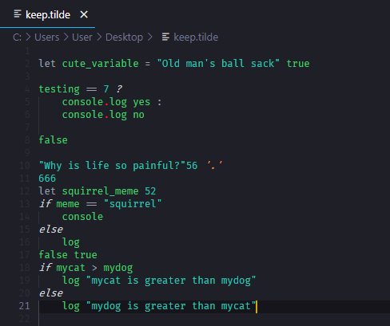

# Tilde vscode extension

NOT IMPLEMENTED :
def|get|obj|class|main|while|for|do|break|continue|try|catch|finally|throw|switch|case|with|new|delete|typeof|instanceof|in|as|is|void|extends|this|super|import|export|from|async|await|public|private|protected|static|readonly|abstract|const|enum|implements|interface|let|package|protected|yield|volatile|number|string|bool|byte|char|double|float|int|long|short|void

Programming is hard, not my words, that's github copilot's quote.

## Features

Syntax highlighting

> Magnificient features, I bet most languages don't even have highlights that impressive!

## Extension Settings

There is literally zero configuration for now. But in case people don't read this, I'll try to make a fool of themselves using `tilde.chocolate` for chocolate mint syntax!

- `tilde.nuclearExplosion`: by default set to `true`. This cause a nuclear explosion if your code doesn't suceed in compiling, if you don't want this, change it to `false`.

> Warning : this option will be modified without notice in the future.

## Known Issues

Work flawlessly, hopefully.

### 1.0.0

Initial release of Tilde vscode extension.
